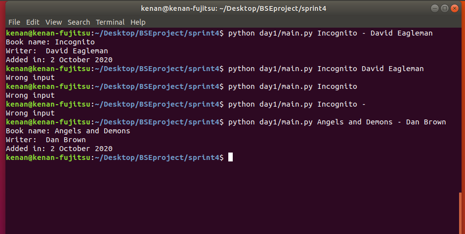

## Console App about Books

### 1.day tasks

* Write a console app which show the book info
* Write your codes into main.py
* When the user enters the book title and author with a hyphen to command line (as python day1/main.py Incognito - David Eagleman), the result should appear as shown in the picture.
* The attachment date should indicate the date the information was entered and should appear in the format shown in the picture.
* If the information is not entered in the required format, the app should give the message 'Wrong input'.

### Console pictures
